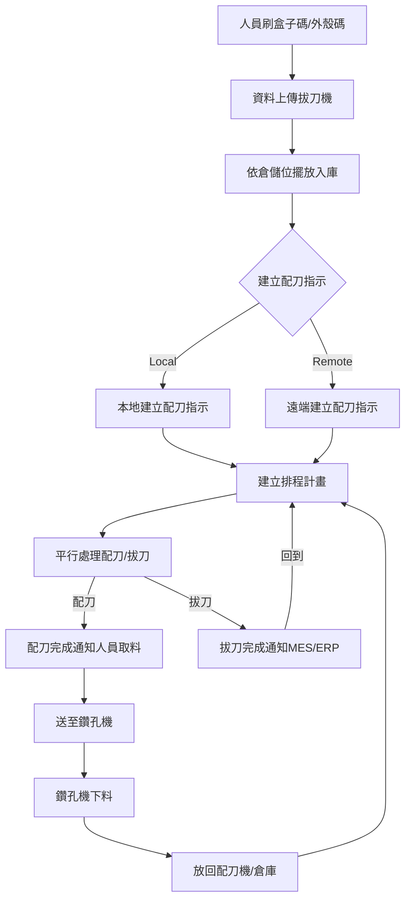
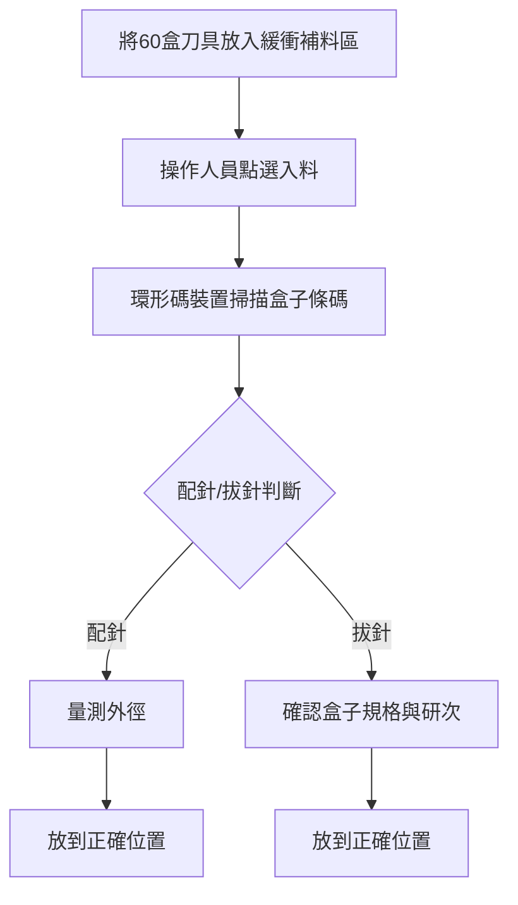
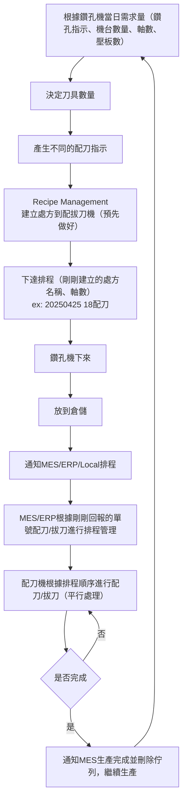
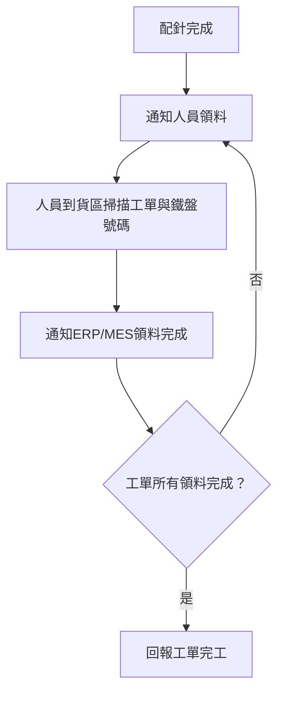
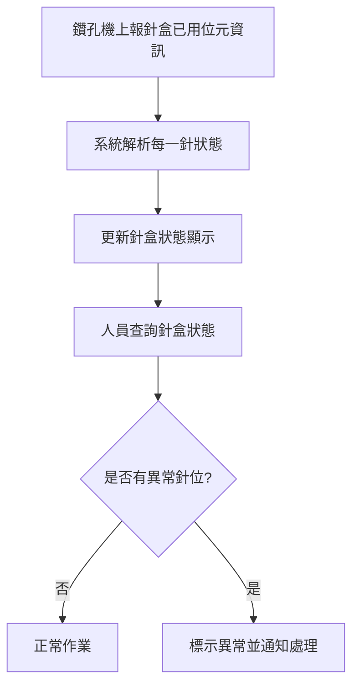
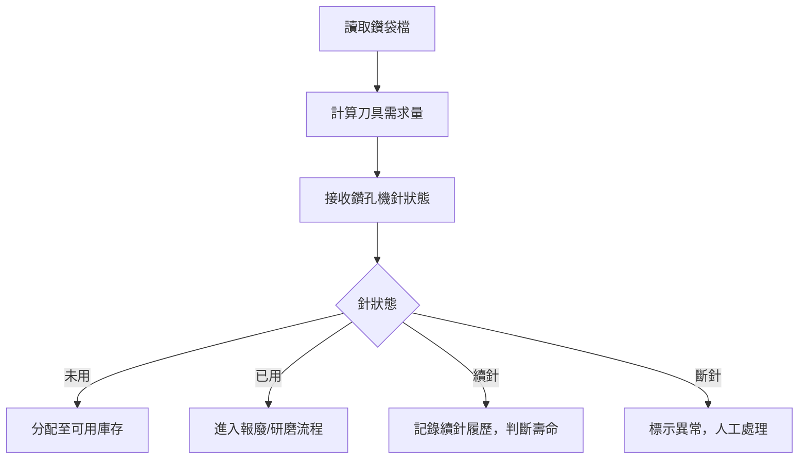

# 刀具管理系統需求規格書（Spec）

## 1. 目的
本規格書旨在定義DAS-2024配針機之系統需求，包括硬體與軟體功能需求、非功能需求、系統架構及介面定義，確保開發與驗收標準一致。

## 2. 適用範圍
本系統涵蓋：
- 硬體：配針機機構（機械手臂、輸送帶、十字盤、圓帶、倉儲層架等），參數調校與保養。
- 軟體：PLC 程式、Windows 10 工業電腦 HMI、MES/ERP 通訊模組、資料庫管理模組。
- 使用者：刀庫人員、維護人員、MES/ERP 系統整合工程師。

## 3. 定義與縮寫
| 縮寫   | 定義                                   |
| ------ | -------------------------------------- |
| HMI    | 人機介面 (Human Machine Interface)     |
| PLC    | 可程式邏輯控制器                       |
| API    | 應用程式介面                           |
| DB     | 資料庫                                 |
| MES/ERP| 製造執行系統/企業資源規劃系統          |
| RACK   | 倉儲層架                               |

## 4. 系統概述
本系統由硬體子系統與軟體子系統組成：
- 硬體子系統：
  - 機械手臂：負責配針與拔針動作。
  - 輸送帶與圓帶：料盒自動傳輸通道。
  - 十字盤：料盒分配與出入料切換裝置。
  - 倉儲層架：400 個儲位，可容納約 20 萬支鑽針。
  - 壓板、感測器、定位銷：確保供料與定位精度。
  - 機台規格：
    - 尺寸：6620×3600×2500 mm
    - 重量：約6100 kg
    - 電源：AC 220V, 50/60Hz, φ1, 2 kW
    - 空壓：5–7 kg/cm², 60 L/min
    - 工業電腦：Windows 10
    - 針盒容量：50 支硬盒 × 6 盒
    - 倉儲容量：400 個儲位
    - 配針速度：3600–4800 支/小時
    - 出入料速度：12–20 料盒/分
- 軟體子系統：
  - PLC 控制模組：實時運動控制與 I/O 監控。
  - HMI (Win10 應用程式)：登入、初始化、配針指示、生產製造、出料、履歷查詢、設定、使用者管理、系統紀錄。
  - 通訊模組：HTTP/REST 與 WebSocket，對接 MES/ERP，支援 Offline/Online 模式。
  - 資料庫管理：SQLite/SQL Server，儲存 PlateInfo、BoxInfo、EPCIDData 等生產與履歷資料。

## 5. 功能需求
| 編號   | 功能描述                         | 優先級 |
| ------ | -------------------------------- | ------ |
| FR-01  | 入料流程與配對                   | 高     |
| FR-02  | 倉儲入庫與庫存管理               | 高     |
| FR-03  | 建立配刀指示與排程               | 高     |
| FR-04  | 配刀/拔刀平行處理                | 高     |
| FR-05  | 出料批次暫存與領料通知           | 中     |
| FR-06  | 回針入庫與針狀態管理             | 高     |
| FR-07  | 刀具壽命判斷與續針履歷           | 高     |
| FR-08  | 產速監控與低庫存警報             | 中     |
| FR-09  | 報表匯出 (Excel)                 | 中     |
| FR-10  | 使用者權限與系統紀錄管理         | 中     |

## 6. 非功能需求
- **性能**：系統支持 3600–4800 支/小時配針，出入料 12–20 盒/分。
- **可靠性**：99% 正常運行時間，支持急停與自動重試。
- **可維護性**：PLC 與 HMI 參數調校介面。
- **安全性**：使用者權限控管，通訊加密 (HTTPS)。

## 7. 系統架構
硬體層 (PLC、感測器、機械臂) → 控制層 (PLC 程式) → 應用層 (HMI .NET/C#) → 資料層 (SQLite/SQL Server) → 整合層 (HTTP/REST, WebSocket)。

## 8. 使用者介面 (UI)
- 登入：帳號、密碼、語系切換。
- 主畫面：初始化、配針指示、生產製造、履歷查詢、儲位資訊、出料區、設定、使用者管理、系統紀錄、關於。
- 初始化：參數載入與原點復歸。
- 配針指示：針盒配置、滿盒/散針區配置、指示檢視/編輯。
- 生產製造：Offline/Online 模式，批號與圓盤參數設定，動作啟停。
- 履歷查詢：時間範圍、工單查詢，支援 Excel 匯出。
- 儲位資訊：顯示儲位數量、研磨次數、庫存狀態。
- 出料區：掃碼、影像檢測、流程控制。
- 設定：報表路徑、相機參數、API 端點。
- 使用者管理：帳號/密碼/權限。
- 系統紀錄：Error/Record/PLC。

## 9. 通訊介面
- HTTP/REST：/api/Dispatch, /api/Load, /api/Status。
- WebSocket：實時狀態推送。
- PLC 通訊：EtherNet/IP 或 Modbus TCP。

## 10. 資料管理
- 資料庫：SQLite (本機) / SQL Server (伺服器)。
- 資料表：PlateInfo, BoxInfo, EPCIDData。
- 備份：每日自動備份至 NAS。

## 11. 錯誤處理與例外
- 未處理例外寫入 ErrorLog。
- 提供重試與復歸按鈕。

## 12. 安全性
- HMI 登入鎖屏；HTTPS 加密。
- PLC 急停、緊急復歸。

## 13. 效能
- 啟動時間 <30s；影像解析 <200ms；API 響應 <100ms。

## 14. 測試計畫
- 單元、整合、驗收測試；PLC 模擬，下線環境驗證。

## 15. 維護與支援
- 遠端升級工具；定期依操作手冊保養。

## 16. 修訂歷史
| 版本   | 日期       | 作者   | 說明           |
| ------ | ---------- | ------ | -------------- |
| 1.0    | 2025-04-25 | PO-YU  | 初版建立       |

---

## 流程

1. 入料流程  
   - 人員先刷取盒子條碼，再刷外殼條碼，確認盒子與外殼配對無誤。
   - 將配對後的資料上傳至拔刀機系統，完成入料登錄。
2. 擺放至倉儲位  
   - 根據系統指示，將盒子放置於指定倉儲位置，完成入庫。
3. 建立配刀指示  
   - Local Mode：於本地端系統建立配刀指示，指派需配刀的刀具與數量。
   - Remote Mode：由遠端系統建立配刀指示，資料同步至本地。
4. 建立排程計畫並執行配拔刀（平行處理）  
   - 系統根據配刀指示自動建立排程計畫，並同時執行多組配拔刀作業。
5. 配刀完成後通知人員取料，將刀具送至鑽孔機。
6. 拔刀完成後，系統通知MES/ERP，告知可排程進行拔刀，並回到建立排程計畫。
7. 鑽孔機下料後入庫  
   - 鑽孔機作業完成後，人員將配刀完成的刀具放回配刀機，並依指示放回倉庫，等待下次排程。

---

### mermaid 流程圖

## 1. 來料與入庫管理
- 支援一次性刀具入庫，刀庫人員可一次性放入60盒刀具，並進行整體消耗化管理。

## 2. 庫存管理
- 顯示即時庫存與待排程量，並標示各分刀具的庫存狀態。
- 具備低庫位提醒功能（提醒流程需後續討論）。
- 具備刀具壽命判斷功能，依據刀具編號、刀盤、研次進行壽命判斷。

### 庫存參考表格

| Storage | Size | Reshape | Box | qty | type    |
| ------- | ---- | ------- | --- | --- | ------- |
| 1       | 0.1  | 1       | 10  | 500 | Spreate |
| 2       | 0.1  | 2       | 10  | 500 | Spreate |
| 3       | 0.1  | 3       | 10  | 500 | Spreate |
| 4       | 0.1  | 4       | 10  | 500 | Spreate |
| 5       | 0.2  | 1       | 10  | 500 | Spreate |
| 6       | 0.2  | 2       | 10  | 500 | Spreate |
| 7       | 0.2  | 3       | 10  | 500 | Spreate |
| 8       | 0.2  | 4       | 10  | 500 | Spreate |
| 9       | 0.3  | 1       | 10  | 500 | Spreate |
| 10      | 0.3  | 2       | 10  | 500 | Spreate |
| 11      | 0.3  | 3       | 10  | 500 | Spreate |
| 12      | 0.3  | 4       | 10  | 500 | Spreate |
| 13      | 0.1  | 1       | 10  | 500 | Remove  |
| 14      | 0.1  | 2       | 10  | 500 | Remove  |
| 15      | 0.1  | 3       | 10  | 500 | Remove  |
| 16      | 0.1  | 4       | 10  | 500 | Remove  |
| 17      | 0.2  | 1       | 10  | 500 | Remove  |
| 18      | 0.2  | 2       | 10  | 500 | Remove  |
| 19      | 0.2  | 3       | 10  | 500 | Remove  |
| 20      | 0.2  | 4       | 10  | 500 | Remove  |
| 21      | 0.3  | 1       | 10  | 500 | Remove  |
| 22      | 0.3  | 2       | 10  | 500 | Remove  |
| 23      | 0.3  | 3       | 10  | 500 | Remove  |
| 24      | 0.3  | 4       | 10  | 500 | Remove  |

## 3. 入料續針判斷及排除

### 配針入盒子流程

- 將60盒刀具放入緩衝補料區。
- 操作人員於系統點選「入料」。
- 使用環形碼裝置掃描盒子條碼，系統確認盒子狀態。
- 系統依據「配針」或「拔針」判斷入料流程：
  - 若為配針：量測外徑，並將盒子放到正確位置。
  - 若為拔針：確認盒子規格與研次，並放到正確位置。

#### mermaid 流程圖

- 系統需具備續針判斷及排除功能，確保續針正確入庫。

## 4. 依派工需求自動配針

本流程依據鑽孔機當日的實際需求，動態決定刀具配針數量與配刀排程，並與 MES/ERP/Local 排程系統自動串接，確保生產效率與資訊即時同步。流程重點如下：

- 依鑽孔機當日需求（鑽孔指示、機台數量、軸數、壓板數）決定所需刀具數量。
- 產生對應的配刀指示，並於 Recipe Management 建立處方，預先配置至配拔刀機。
- 下達排程（包含處方名稱、軸數等資訊），如：20250425 18配刀。
- 鑽孔機作業完成後，刀具放入倉儲，並自動通知 MES/ERP/Local 進行排程。
- MES/ERP 根據回報單號，進行配刀/拔刀排程管理。
- 配刀機依排程順序自動執行配刀/拔刀，並支援平行處理。
- 完成後自動通知 MES 生產完成，並刪除佇列，流程持續循環。
- 刀盤需指定廠台、輔別、順序，系統需比對正確才能生產。
- 刀盤未使用時，需能返回系統針並一併接班回，系統需驗證未使用。
- 預測排程可指定（指導），自動排程可指導，未來 Lot 自動導入 MES 需確認是否支援。

### mermaid 流程圖

## 5. 出料批次暫存區

出料批次流程說明：

1. 配針完成後，系統需通知人員前往領料。
2. 人員到貨區後，掃描工單與鐵盤號碼，並通知 ERP/MES，完成領料登記。
3. 當該工單所有領料作業完成後，系統需自動回報該工單完工。

### mermaid 流程圖

- 配針分批時需選擇批次，至少需有6個備位供使用。
- 系統需依據需求告知批次刀具針數，並判斷是否已取走/未取。

## 6. 回針入料方式
- 支援一次性回針入庫，刀庫人員可一次性放入60盒刀具，並進行整體消耗化管理。

## 7. 回針裝置分針針狀態

本流程根據鑽孔機上報的已用位元資訊，動態顯示每一針的使用狀態（已用、未用、續針、斷針等），並可視覺化呈現於系統介面，方便人員判斷與管理。

### 狀態圖示範例

### 流程說明
1. 鑽孔機上報每一針的使用狀態（已用/未用/續針/斷針）。
2. 系統依據上報資訊即時更新針盒狀態。
3. 人員可於系統介面查詢每一針的狀態，並依據狀態進行後續作業。

### mermaid 流程圖

- 系統需顯示分針針狀態（是否用過/未用過/續針/斷針）。

## 8. 回針裝置針料方式
- 系統需具備回針裝置針料方式（已用針/未用針/續針）。
- 需先有人員標示作法。

## 9. 研磨壓耗批次確認
- 預測研磨批次前後不需更新刀具號（或可選擇是否更新刀具資訊）。
- 研磨批次可設定刀具壽命，刀具壽命到期時需自動提醒。

## 10. 續針履歷追溯
- 系統需具備續針履歷追溯功能。
- 已使用續針需有完整記錄（如續針批次、使用次數、使用廠台）。

## 11. 產速可控需求
- 產速控制範圍：62822 pcs/hr。

## 12. 刀具續命需求
- 刀具壽命需可設定（如刀具壽命60000 hr/pcs）。

## 13. 支援整併作業
- 系統需支援整併作業功能，可動態建立批次。

## 鑽袋檔

| Tcode | 孔數 | Size | 孔限 | 研次 | 環顏色 | 刀型 |
|-------|------|------|------|------|--------|------|
| T01   | 90   | 0.468| 500  | 1    | #F76C5E| A    |
| T02   | 1472 | 0.45 | 1200 | 1    | #57C4E5| A    |
| T03   | 2028 | 0.451| 1200 | 1    | #A16AE8| A    |
| T04   | 10   | 0.7  | 1000 | 1    | #4CD964| A    |
| T05S  | 36   | 0.904| 1000 | 1    | #FF9F1C| A    |
| T06   | 265  | 1    | 1000 | 1    | #374785| A    |
| T07   | 192  | 1.075| 1000 | 1    | #F1C40F| A    |
| T08   | 96   | 1.35 | 1000 | 1    | #F67280| A    |
| T09   | 4    | 1.6  | 1000 | 1    | #3EC1D3| A    |
| T10   | 192  | 1.675| 1000 | 1    | #B388EB| A    |
| T11S  | 12   | 1.754| 1000 | 1    | #2ECC71| A    |
| T12   | 96   | 1.775| 1000 | 1    | #E74C3C| A    |
| T13   | 6    | 2    | 800  | 1    | #3498DB| A    |
| T14   | 24   | 2.4  | 800  | 1    | #FFC75F| A    |
| T15   | 12   | 2.7  | 800  | 1    | #42E6A4| A    |
| T16S  | 12   | 2.703| 800  | 1    | #D65DB1| A    |
| T17   | 12   | 2.8  | 800  | 1    | #ACD8AA| A    |
| T18   | 12   | 3    | 500  | 1    | #FC5185| A    |
| T19   | 60   | 3.075| 500  | 1    | #70C1B3| A    |
| T20   | 9    | 3.2  | 500  | 1    | #B83B5E| A    |
| T21   | 5    | 3.201| 500  | 1    | #F08A5D| A    |
| T22   | 24   | 4.1  | 500  | 1    | #845EC2| A    |
| T23S  | 52   | 2    | 500  | 1    | #0081CF| A    |

### mermaid 流程圖

---

## QA 問題彙整

### 配刀指示格式討論

目前配刀指示（如 SWITCH_RECIPE_COMMAND 或 DISPATCH_AUTO_ASSIGN_COMMAND）格式已有初步 JSON 範例，但實際欄位（如配刀批次、刀型、數量、機台、軸別、順序、Recipe 參數等）是否足夠，需與 MES/ERP/現場單位進一步討論確認，確保所有生產資訊皆能完整傳遞。
建議：可先依 Spec.md 及現有 API 範例進行測試，並彙整現場需求後再最終定稿。

### 第5項出貨刷驗是否還需要

出料批次暫存區流程中，原設計為人員到貨區需刷驗工單與鐵盤號碼，並通知 ERP/MES 完成領料登記。
建議：若現場流程已可由系統自動判斷批次與領料狀態，且人員誤領風險可控，則可考慮簡化或取消刷驗流程。否則建議保留刷驗，確保出貨正確性與可追溯性。

### 排程接收輪巡次數（預設5分鐘）

目前建議排程資料輪詢間隔為5分鐘（即每5分鐘自動向 MES/ERP 查詢一次新排程）。
建議：可依實際生產節奏與系統負載調整輪詢頻率，若需更即時可縮短間隔，若流量壓力大則可拉長。預設5分鐘為一般建議值，後續可依現場需求調整。

## 17. 操作流程與SOP
- 系統啟動：依照順序開啟主電源、工業電腦、PLC，啟動HMI應用程式，登入後進行原點復歸。
- 系統關機：先停止所有執行動作，登出HMI，依序關閉PLC、工業電腦、主電源。
- 緊急復歸：遇到異常（如急停、感測器異常），依HMI指示執行異常復歸，必要時通知維護人員。
- 操作人員需依SOP完成每次入料、出料、配刀、拔刀、回針等作業，並於HMI確認流程狀態。

## 18. 異常處理與警報
- 常見異常：
  - 感測器異常、機構卡住、通訊失敗、資料庫連線失敗、API回應逾時。
- 處理方式：
  - HMI即時顯示異常訊息，並記錄於ErrorLog。
  - 提供異常說明、處理建議（如檢查感測器、重啟PLC、確認網路連線）。
  - 支援異常復歸按鈕，部分異常需管理員權限。
- 警報分級：
  - 一般警告、重要警報、危急停機，分級顯示於HMI。

## 19. 維護與保養
- 定期保養項目：
  - 感測器清潔、機械潤滑、PLC/電控箱除塵、HMI備份。
- 保養週期：
  - 每日、每週、每月、每半年，依操作手冊建議執行。
- 保養紀錄：
  - HMI提供保養紀錄登錄與查詢，並可匯出Excel。

## 20. 權限管理與角色
- 角色分級：
  - 管理員：全功能（含系統設定、異常復歸、帳號管理、日誌查詢）。
  - 操作員：日常作業（入料、出料、配刀、查詢）。
  - 維護員：維護保養、異常處理。
- 權限設定：
  - 各功能模組依角色權限顯示/隱藏。
  - 密碼強度要求，支援定期更換與登入失敗鎖定。

## 21. 系統設定與參數
- 語系切換：支援繁中/簡中/英文。
- API端點、資料備份路徑、相機參數、報表路徑等可於HMI設定。
- 設定變更需管理員權限，並記錄於系統日誌。

## 22. 日誌與追蹤
- 操作日誌：記錄所有登入、登出、設定變更、異常復歸、配刀/拔刀/回針等操作。
- 錯誤日誌：自動記錄所有未處理例外、警報、異常事件。
- 交易日誌：記錄所有與MES/ERP的資料交換、API呼叫。
- 日誌查詢：HMI支援條件查詢、匯出Excel。
- 日誌保存：本機保存一年，並每日自動備份至NAS。

## 23. 介面說明（補充）
- 各主要畫面（登入、主畫面、配針指示、履歷查詢、設定等）提供操作說明。
- 主要按鈕、欄位、警示燈號、狀態列等皆有Tooltip或說明文字。
- 若有異常，相關欄位高亮顯示並彈出說明。

## 24. 進階功能
- 支援批次作業、批次回報、批次異常處理。
- 支援遠端診斷、遠端升級（需管理員權限）。
- 支援多語系切換。
- 支援批次資料匯入/匯出。

## 25. 安全與審計
- 密碼強度要求（至少8碼，含英文大小寫與數字）。
- 密碼週期（建議90天更換），登入失敗5次鎖定帳號。
- 所有設定變更、異常復歸、權限調整皆記錄於審計日誌。
